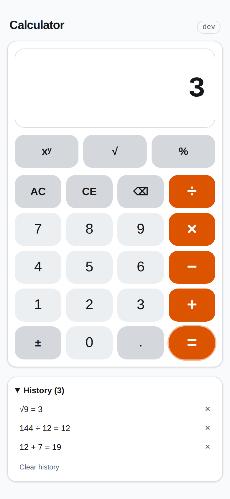
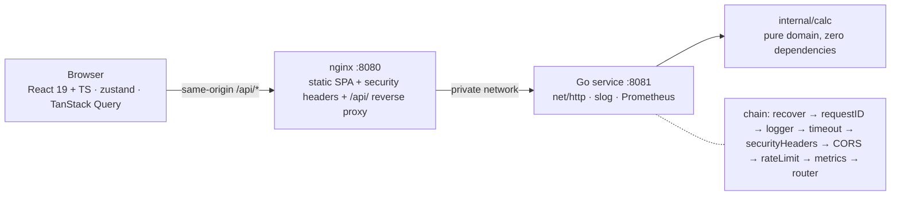

# go-react-calculator

[](https://github.com/isasumer/go-react-calculator/actions/workflows/backend.yml)
[](https://github.com/isasumer/go-react-calculator/actions/workflows/frontend.yml)
[](https://github.com/isasumer/go-react-calculator/actions/workflows/stack.yml)
[](https://github.com/isasumer/go-react-calculator/actions/workflows/security.yml)

**Live demo:** https://go-react-calculator.vercel.app

[Overview](#overview) · [Quick start](#quick-start) · [API](#api) · [Design decisions](#design-decisions) ·
[Testing](#testing) · [Project structure](#project-structure) · [Configuration](#configuration) ·
[Time log](#time-log) · [Prompts](#prompts) · [License](#license)

## Overview

A full-stack calculator: a Go REST microservice that evaluates one arithmetic operation per request, and
a React + TypeScript single-page app that is its only client. Seven operations — add, subtract, multiply,
divide, power, square root, percentage — one screen, no accounts and no database. The product surface is
exactly the assignment; everything extra went into operational maturity rather than into features (see
[what the assignment asked vs what I added](#what-the-assignment-asked-vs-what-i-added-and-why)).

The frontend never does arithmetic. Pressing a key runs a pure state machine
(`src/lib/calculator-engine.ts`) that can ask for exactly one effect — "evaluate this on the server" — so
every number on the display came back from `POST /api/v1/calculate`, including the division behind a
percentage ([ADR-0008](docs/adr/0008-frontend-evaluation-semantics.md)). The backend is stdlib-only
`net/http` with a typed config, an explicit middleware chain, RFC 9457 `problem+json` errors carrying a
stable machine `code`, Prometheus metrics and a graceful shutdown, all described by an OpenAPI 3.1
contract that the tests validate every handler response against. In production both run as distroless
non-root containers behind one nginx that serves the app and proxies `/api/` over a private network, so
the API has no host port at all. The [live demo](https://go-react-calculator.vercel.app) runs the same two
apps on Vercel with the same single-origin layout ([Deploy to Vercel](#4-deploy-to-vercel)).

<p align="center">
  
</p>

<p align="center"><em>Light theme, mobile. Dark mode follows <code>prefers-color-scheme</code>, and the
history panel moves beside the keypad on a wide viewport:
<a href="docs/screenshots/calculator-dark-mobile.png">dark · mobile</a> ·
<a href="docs/screenshots/calculator-light-desktop.png">light · desktop</a> ·
<a href="docs/screenshots/calculator-dark-desktop.png">dark · desktop</a>.</em></p>



Deeper: [`docs/ARCHITECTURE.md`](docs/ARCHITECTURE.md) (request lifecycle, error taxonomy, state machine,
storage, operational notes) · [`docs/PLAN.md`](docs/PLAN.md) (the plan and every ticket) ·
[`CLAUDE.md`](CLAUDE.md) (the AI session protocol this repository was built with).

## Quick start

### 1. Docker Compose — nothing but Docker required

```sh
docker compose up --build        # or: make up  (adds --wait)
```

Then open <http://localhost:8080>. nginx serves the app and proxies `/api/` to the Go service over a
private network, so the API is not published on the host — the same shape as production
([ADR-0009](docs/adr/0009-containers-and-proxy.md)).

```sh
make smoke   # 9 black-box assertions against the running stack
make logs    # follow both services
make down    # stop and clean up
```

`make smoke` checks what a reviewer would click through, from outside the containers: the operations list
and `12 + 7` through the proxy, an `X-Request-ID` on the response, `1/0` → `422` `problem+json`,
`index.html` served `no-cache` while hashed assets get a one-year immutable cache, the security headers,
and that the backend is **not** reachable on `localhost:8081`.

To poke the API directly, `cp compose.override.example.yaml compose.override.yaml` and bring the stack
back up; that publishes it on `:8081` and switches the logs to text. If port 8080 is taken on your
machine, `FRONTEND_PORT=18080 make up` moves the host side only — then
`BASE_URL=http://localhost:18080 ./scripts/smoke.sh`.

### 2. Local dev servers — Go 1.27 + Node 22

```sh
CORS_ALLOWED_ORIGINS=http://localhost:5173 VITE_API_BASE_URL=http://localhost:8081/api make dev
```

One command, two servers, `Ctrl-C` stops both:

| | URL | On its own |
|---|---|---|
| Vite dev server (HMR) | <http://localhost:5173> | `make -C frontend dev` |
| Go API | <http://localhost:8081> | `make -C backend run` — `PORT=9000 make -C backend run` to move it |

Those two environment variables are the whole difference between dev and production, and only dev needs
them: Vite and the Go server are on different origins, so the app must be told the absolute API base
(`VITE_API_BASE_URL`, default `/api`) and the server must allow that origin (`CORS_ALLOWED_ORIGINS`,
default empty). In production both stay at their defaults, because nginx makes everything same-origin.

### 3. Run the tests

```sh
make check   # both apps: format check → lint → vet/type-check → tests → coverage gates
make e2e     # Playwright against a running stack
```

`make check` is the same gate CI runs on every pull request. `make e2e` assumes the stack is already up
with the e2e overlay, which only raises the rate limit so a browser clicking as fast as it can is not
throttled:

```sh
docker compose -f compose.yaml -f compose.e2e.yaml up --build --wait
make -C e2e install     # first run only: npm ci + playwright install chromium webkit
make e2e
```

### 4. Deploy to Vercel

The same two apps also run as one Vercel project using [Services](https://vercel.com/docs/services)
(`vercel.json`). The Vite build serves the SPA. The backend is built from `backend/Dockerfile` as a
container service. A top-level rewrite sends `/api/*` to the Go service, so the browser still sees one
origin and the ADR-0009 model holds: no CORS, and the operational endpoints (`/metrics`, `/readyz`,
`/version`) are not public. The security headers in `frontend/nginx/security-headers.conf` are repeated
in `vercel.json` for every non-API path.

The project is connected to this repository through Vercel's Git integration, so no deploy step is needed:

| Event | Result |
|---|---|
| Push to a pull-request branch | Preview deployment with its own URL, reported as the `Vercel` check on the PR |
| Merge to `main` | Production deployment at https://go-react-calculator.vercel.app |

Two settings live in the Vercel project instead of the repository, because they describe the platform
rather than the app: `TRUST_PROXY_HEADERS=true`, so the rate limiter keys on the client address that
Vercel's edge puts in `X-Forwarded-For` instead of the edge's own, and `LOG_FORMAT=json`. To set up a new
project or deploy by hand:

```sh
vercel link --project go-react-calculator
vercel env add TRUST_PROXY_HEADERS production   # "true"
vercel env add LOG_FORMAT production            # "json"
vercel deploy --prod                            # or `vercel deploy` for a preview
```

## API

Base path `/api/v1`. Every success is JSON; every error is `application/problem+json`.

| Method | Path | Purpose |
|---|---|---|
| `POST` | `/api/v1/calculate` | Evaluate one operation on one or two operands |
| `GET` | `/api/v1/operations` | The operation registry the UI builds its keypad from |
| `GET` | `/api/v1/openapi.yaml` | The OpenAPI 3.1 contract, embedded in the binary that serves it |
| `GET` | `/healthz` | Liveness — `200` even while draining |
| `GET` | `/readyz` | Readiness — `503 NOT_READY` from the moment shutdown starts |
| `GET` | `/version` | `{version, commit, buildDate, goVersion}` of the running binary |
| `GET` | `/metrics` | Prometheus exposition |

### Calculate — binary

```http
POST /api/v1/calculate
Content-Type: application/json

{"operation":"divide","a":10,"b":4}
```

```json
{"operation":"divide","a":10,"b":4,"result":2.5}
```

### Calculate — unary

`b` must be **omitted** for an arity-1 operation; sending it is a `422 UNEXPECTED_OPERAND`.

```http
POST /api/v1/calculate
Content-Type: application/json

{"operation":"sqrt","a":16}
```

```json
{"operation":"sqrt","a":16,"result":4}
```

### Operations

```http
GET /api/v1/operations
```

```json
{"operations":[{"name":"add","symbol":"+","arity":2},{"name":"subtract","symbol":"−","arity":2},{"name":"multiply","symbol":"×","arity":2},{"name":"divide","symbol":"÷","arity":2},{"name":"power","symbol":"^","arity":2},{"name":"sqrt","symbol":"√","arity":1},{"name":"percent","symbol":"%","arity":2}]}
```

### A 400 — the request is malformed

`{"operation":"add","a":1}` is well-formed JSON with a required field missing:

```json
{
  "type": "https://github.com/isasumer/go-react-calculator/blob/main/docs/errors.md#validation_failed",
  "title": "Validation failed",
  "status": 400,
  "detail": "missing or invalid fields: b",
  "code": "VALIDATION_FAILED",
  "instance": "/api/v1/calculate",
  "requestId": "4bf92f35-77b3-4da6-a3ce-929d0e0e4736",
  "errors": [
    {
      "field": "b",
      "message": "is required for operation \"add\""
    }
  ]
}
```

### A 422 — the request is fine, the arithmetic has no answer

`{"operation":"divide","a":1,"b":0}`:

```json
{
  "type": "https://github.com/isasumer/go-react-calculator/blob/main/docs/errors.md#division_by_zero",
  "title": "Division by zero",
  "status": 422,
  "detail": "b must be non-zero for operation \"divide\"",
  "code": "DIVISION_BY_ZERO",
  "instance": "/api/v1/calculate",
  "requestId": "4bf92f35-77b3-4da6-a3ce-929d0e0e4736",
  "errors": [
    {
      "field": "b",
      "message": "must be non-zero"
    }
  ]
}
```

That split is the whole error design: **400 means the client sent something the server cannot parse or
accept; 422 means the client sent a valid request and the arithmetic has no answer.** Clients branch on
`code`, never on `title` or `detail` — those are for humans and may be reworded — and `type` is the URL of
that code's section in the catalogue.

**Problem shape.** `type`, `title`, `status`, `detail`, `code` and `instance` are always present;
`requestId` whenever the request has one (it always does behind the middleware chain), and `errors[]`
(`[{field, message}]`) whenever the failure is field-specific. All 15 codes, with the client behaviour
each one calls for and a full example, are in [`docs/errors.md`](docs/errors.md); where in the process
each one is produced is in [`docs/ARCHITECTURE.md` § Error taxonomy](docs/ARCHITECTURE.md#error-taxonomy).

### One-liners

```sh
# curl
curl -s localhost:8080/api/v1/operations
curl -s -X POST localhost:8080/api/v1/calculate -H 'Content-Type: application/json' -d '{"operation":"divide","a":10,"b":4}'
curl -s -X POST localhost:8080/api/v1/calculate -H 'Content-Type: application/json' -d '{"operation":"sqrt","a":16}'
curl -si -X POST localhost:8080/api/v1/calculate -H 'Content-Type: application/json' -d '{"operation":"divide","a":1,"b":0}'

# httpie
http :8080/api/v1/operations
http POST :8080/api/v1/calculate operation=divide a:=10 b:=4
http POST :8080/api/v1/calculate operation=sqrt a:=16
```

### The contract

[`backend/api/openapi.yaml`](backend/api/openapi.yaml) is OpenAPI 3.1, and it is not decoration: it is
embedded with `//go:embed`, served at `GET /api/v1/openapi.yaml`, and
`backend/internal/httpapi/openapi_test.go` validates **every response the handler table tests produce**
against it. A status the contract does not document, a `code` that does not belong to its status, or a
body that does not match its schema fails the build rather than the client. Read it as documentation:

```sh
docker run --rm -p 8080:80 -v "$PWD/backend/api:/usr/share/nginx/html/spec:ro" \
  -e SPEC_URL=spec/openapi.yaml redocly/redoc   # then open http://localhost:8080
```

## Design decisions

Every decision that would be expensive to reverse is an ADR under [`docs/adr/`](docs/adr/README.md), with
the alternatives it rejected. All nine are Accepted.

| ADR | Decision | Why |
|---|---|---|
| [0001](docs/adr/0001-monorepo-layout.md) | Monorepo, two independent build roots plus `e2e/` | One link to share; each app still builds and tests alone, and CI path filters keep runs cheap |
| [0002](docs/adr/0002-frontend-stack.md) | Vite + React 19 + TS strict, Tailwind v4, shadcn primitives, TanStack Query, zustand | Mirrors a production frontend I maintain; Vite rather than Next.js because there is no routing or SSR need |
| [0003](docs/adr/0003-numeric-model.md) | `float64` with explicit non-finite guards, `-0` normalised, sentinel errors per failure | JSON numbers are doubles anyway; the API stays truthful about `0.1 + 0.2` and the UI rounds for display. Money would need decimals — said so rather than pretending |
| [0004](docs/adr/0004-single-calculate-endpoint.md) | One `POST /api/v1/calculate` with an operation enum, plus `GET /api/v1/operations` | Adding an operation is one registry entry the UI picks up automatically; the URL surface stays flat |
| [0005](docs/adr/0005-problem-json-errors.md) | RFC 9457 `problem+json` with a stable machine `code` | Standardised and extensible; the client maps `code` → UX and `type` links to the catalogue. 400 = malformed, 422 = valid but unanswerable |
| [0006](docs/adr/0006-runtime-stack.md) | Stdlib `http.ServeMux` with method patterns, `log/slog`, Prometheus client on an injected registry | Idiomatic and readable end to end: no framework to learn, and no global registry to poison |
| [0007](docs/adr/0007-display-precision.md) | 12 significant digits, exponent beyond ±1e15 / 1e-6, `en-US` grouping | Calculator UX convention: shows `0.3`, not `0.30000000000000004`, without the API lying |
| [0008](docs/adr/0008-frontend-evaluation-semantics.md) | Evaluate only through the API; immediate execution, no precedence | The assignment is about consuming the backend, so even `%` round-trips; `2 + 3 × 4 =` is 20, like a pocket calculator |
| [0009](docs/adr/0009-containers-and-proxy.md) | Distroless non-root images, same-origin `/api` proxy via nginx, no CORS in production | Smallest attack surface; the CORS allowlist exists only for `make dev` |

Security policy, supported versions and how to report a vulnerability: [`SECURITY.md`](SECURITY.md).

### What the assignment asked vs what I added, and why

The brief suggested 2–4 hours. Measured from the pull-request timestamps rather than estimated, this
took about 4½ hours of actual working time — just past the top of that envelope, and only because the
work was AI-assisted (see [Time log](#time-log)). None of it went into "more features": the product
surface is exactly the assignment. It went into the things a reviewer cannot see from a screenshot.

| Assignment requirement | Where it is satisfied | Beyond the brief, and why |
|---|---|---|
| React (TypeScript) frontend consuming a Go REST microservice | [`frontend/`](frontend/) and [`backend/`](backend/), same origin through nginx | TS `strict` plus `noUncheckedIndexedAccess` and `exactOptionalPropertyTypes`, and zod validation at the HTTP boundary — a contract change fails loudly in the client instead of rendering `undefined` |
| add, subtract, multiply, divide (+ optional power, sqrt, percentage) | All seven; `GET /api/v1/operations` is what the keypad is built from | The operations live in one registry, so adding one is a single entry the UI picks up with no frontend change. Cost: the shape it already had |
| Frontend: intuitive UI, input validation, error handling, basic responsiveness | [`frontend/src/components/calculator/`](frontend/src/components/calculator) | Full keyboard support, dark mode, a 50-entry history in versioned `localStorage`, and axe checks in both component and e2e tests. Why: "intuitive" is not testable, these are. Cost: ~3 tickets |
| Backend: endpoints per operation, input validation, edge cases (division by zero, invalid data), JSON responses | `POST /api/v1/calculate`, catalogue in [`docs/errors.md`](docs/errors.md) | RFC 9457 `problem+json` with a stable `code` instead of ad-hoc `{"error":"…"}`, and a 400/422 split you can state in one sentence. Why: an error format is a contract and clients branch on it. Cost: ~1 file plus the catalogue |
| Clean, idiomatic code | Stdlib router, no framework, no globals, dependencies injected via structs, `run(ctx, args, getenv, stdout)` | Nine ADRs recording what was rejected and why. Why: "idiomatic" is a claim; the rejected alternatives are the evidence |
| Unit tests on both layers **with a coverage report** | `make check` — 98.1 % Go, 100 % lines frontend | Fuzz and benchmark, contract tests validating every handler response against the OpenAPI document, component tests with MSW, axe, a black-box smoke script, and a Playwright suite. Why: the coverage report is the graded artefact, and a CI gate is what stops it rotting in week two. Cost: most of the extra time |
| README with setup, run, API examples and design rationale | This file | Split into [ARCHITECTURE](docs/ARCHITECTURE.md), the [error catalogue](docs/errors.md) and the [ADRs](docs/adr/README.md). Why: a README that explains everything explains nothing |
| Optional Dockerfile for the whole stack | [`compose.yaml`](compose.yaml) plus two Dockerfiles | Distroless non-root, read-only rootfs, `cap_drop: [ALL]`, a self-probing healthcheck (the image has no shell), 5.5 MB backend / 5.9 MB frontend, and the API deliberately not published. Why: an "optional Dockerfile" that runs as root from a 900 MB base is worse than none. Cost: 1 ticket |
| Share the AI prompts used | [`docs/PROMPTS.md`](docs/PROMPTS.md) | One section per session, prompts verbatim, plus what was **rejected** and why. Why: the rejections are the only part that shows judgement |
| — *(not asked)* | Rate limiting — `internal/middleware/ratelimit.go` | Not needed for a calculator; included because any internet-facing pure-function API needs one abuse control, and the cost was ~1 file plus its test |
| — *(not asked)* | Structured logs, request IDs, Prometheus metrics, per-request timeouts, graceful shutdown with a pre-stop delay | This is what "production-grade" actually means, and none of it can be retrofitted convincingly. Cost: ~2 tickets |
| — *(not asked)* | OpenAPI 3.1 contract: embedded, served, and enforced by tests | Documentation that cannot drift, because drift fails the build. Cost: 1 ticket |
| — *(not asked)* | CI gates and supply chain: CodeQL, Trivy, gitleaks, `npm audit`, `govulncheck`, branch protection | A green badge that means something. Cost: ~1.5 tickets |
| **Deliberately not added** | — | Auth, a database, user accounts, decimal arithmetic, i18n, operator precedence, an expression parser, a container registry release pipeline. Each is either a different product or a filed follow-up; none of them makes this calculator better |

## Testing

Seven layers, each with one job. All of them run in CI on every pull request.

| Layer | Where | Run it |
|---|---|---|
| Go unit — table-driven, `-race -shuffle=on` | 27 `_test.go` files across 7 packages | `make -C backend test` |
| Go fuzz — `FuzzEvaluate` over the whole registry | `internal/calc` | `go test ./internal/calc -run '^$' -fuzz FuzzEvaluate -fuzztime 30s` |
| Go contract — every handler response validated against `api/openapi.yaml` with kin-openapi | `internal/httpapi/openapi_test.go` | part of `make -C backend test` |
| Go integration — `run()` driven exactly as `main` drives it, over a real listener, including the shutdown drain | `cmd/server` | part of `make -C backend test` |
| Frontend unit, hooks and components — Vitest + jsdom + Testing Library, HTTP intercepted with MSW, axe on rendered screens | 22 test files, 440 tests | `make -C frontend test` |
| Smoke — 9 black-box assertions against the composed stack, from outside the containers | [`scripts/smoke.sh`](scripts/smoke.sh) | `make smoke` |
| End-to-end — Playwright, 5 specs / 10 tests: click and keyboard flows, chained operators, errors, history across a reload, axe, and the mobile layout on WebKit | [`e2e/`](e2e/) | `make e2e` |

### Coverage

Backend, from `make -C backend test`:

| Package | Coverage |
|---|---|
| `api` | 80.0 % |
| `cmd/server` | 94.0 % |
| `internal/calc` | 100.0 % |
| `internal/config` | 100.0 % |
| `internal/httpapi` | 97.6 % |
| `internal/middleware` | 99.6 % |
| `internal/observability` | 100.0 % |
| **total** | **98.1 %** |

Frontend, from `npm run test:coverage`:

```
Test Files  22 passed (22)
     Tests  440 passed (440)

Statements   : 100%   (625/625)
Branches     : 98.6%  (423/429)
Functions    : 100%   (182/182)
Lines        : 100%   (590/590)
```

**What CI enforces.** `backend/scripts/coverage-check.sh` fails the build below **85 %** total statements;
`frontend/vitest.config.ts` fails below **85 %** lines, statements and functions and **80 %** branches.
Both are gates, not targets — lowering one to get green is explicitly forbidden by
[`CLAUDE.md`](CLAUDE.md). The frontend job also posts a per-file table to the run summary and uploads
`lcov.info`.

**What is deliberately not tested.** The vendored shadcn primitives under `components/ui/**` (restyled
through tokens, never forked, and excluded from coverage), `src/main.tsx` (three lines of mounting),
`nginx.conf` beyond what `smoke.sh` asserts from outside, and anything visual — there is no pixel-diffing
suite, because a screenshot test on a layout still being designed fails for the wrong reason every time.
Load and performance are covered by one `BenchmarkEvaluate` rather than a load test: the service does a
single floating-point operation per request, so its latency budget is dominated by the network, not by
the arithmetic.

## Project structure

```
go-react-calculator/
├── backend/                  Go module: the API service — see backend/README.md
│   ├── api/                  openapi.yaml — the contract, embedded and served
│   ├── cmd/server/           composition root: config → deps → router → http.Server
│   ├── internal/             calc (pure domain) · httpapi · middleware · config · observability
│   ├── scripts/              coverage-check.sh — the 85 % gate
│   └── tools/                separate module pinning golangci-lint, gofumpt, govulncheck
├── frontend/                 Vite + React 19 + TypeScript app — see frontend/README.md
│   ├── src/                  app · components · hooks · lib · stores · types · test
│   ├── nginx/                nginx.conf for the production image: static SPA + /api/ proxy
│   └── Dockerfile            node:22-alpine build → nginx-unprivileged:alpine-slim
├── e2e/                      Playwright suite against the composed stack
├── docs/                     PLAN.md · ARCHITECTURE.md · errors.md · PROMPTS.md · adr/ · screenshots/
├── scripts/smoke.sh          black-box assertions against a running stack
├── .github/workflows/        backend · frontend · stack · security
├── compose.yaml              the whole product: nginx :8080 → Go :8081, private
├── compose.e2e.yaml          overlay raising the rate limit for the Playwright run
├── vercel.json               Vercel Services: Vite SPA + backend container, /api/* → backend
├── .vercelignore             keeps build output, coverage and e2e out of the Vercel upload
├── Makefile                  umbrella targets: dev · check · test · up · down · smoke · e2e
├── CLAUDE.md                 session bootstrap for the AI-assisted workflow
└── SECURITY.md               threat model summary and disclosure policy
```

## Configuration

**Backend** — configured entirely by the environment; no config files and no flags other than `-version`
and `-healthcheck`. Every variable is optional, an unparsable value is fatal at startup, and all bad
values are reported at once so one restart shows every mistake. The complete table — `HOST`, `PORT`,
`LOG_LEVEL`, `LOG_FORMAT`, `CORS_ALLOWED_ORIGINS`, the four `http.Server` timeouts, `SHUTDOWN_TIMEOUT`,
`PRE_STOP_DELAY`, `REQUEST_TIMEOUT`, `RATE_LIMIT_RPS`, `RATE_LIMIT_BURST`, `MAX_BODY_BYTES` and
`TRUST_PROXY_HEADERS` — with defaults and meanings is in
[`backend/README.md` § Configuration](backend/README.md#configuration).

**Frontend** — one build-time variable, `VITE_API_BASE_URL` (default `/api`), read in exactly one module,
`src/config.ts`: [`frontend/README.md` § Configuration](frontend/README.md#configuration).

**Compose level** — three knobs, and nothing else has to change to run the stack elsewhere:

| Variable | Default | What it does |
|---|---|---|
| `FRONTEND_PORT` | `8080` | Moves the **host** side of the published port only. Everything inside the stack, and `smoke.sh`, still speaks 8080 |
| `BACKEND_UPSTREAM` | `backend:8081` | The upstream nginx proxies `/api/` to, substituted into the config at container start, so one image runs in Compose and anywhere else |
| `VERSION` / `COMMIT` / `BUILD_DATE` | `dev` / `none` / `unknown` | Build args stamped into both images; they surface in `server -version`, `GET /version` and the `build_info` metric |

## Time log

Honest, and derived from the timestamps of the 21 merged pull requests rather than typed from memory.
Times are Europe/Istanbul (UTC+03), which is why the work spans two calendar dates.

| Sprint | Tickets | From (first PR opened) | To (last PR merged) | Wall clock |
|---|---|---|---|---|
| Planning | the plan, ticket manifest, `CLAUDE.md` | 09-22 19:20 (repo created) | 09-22 19:42 | 0 h 22 m |
| 0 — Foundation | P0-01 … P0-04 | 09-22 19:42 | 09-22 20:31 | 0 h 49 m |
| 1 — Backend core | B1-01 … B1-06 | 09-22 20:36 | 09-23 01:22 | 4 h 47 m |
| 2 — Frontend core | F2-01 … F2-05 | 09-22 21:08 | 09-23 01:48 | 4 h 40 m |
| 3 — Hardening | H3-01, H3-04, H3-05 | 09-23 01:41 | 09-23 02:03 | 0 h 23 m |
| 4 — Docs & submission | D4-01 (this change) | 09-23 02:03 | 09-23 02:40 | ~0 h 37 m |

Those spans overlap and so do not add up. Sprints 1 and 2 were interleaved — a backend session, then a
frontend session, in separate git worktrees — and the Sprint 1 window contains a **2 h 59 m break** with
no activity at all. Two numbers mean something instead:

- **Elapsed, end to end:** 09-22 19:20 → 09-23 02:40 = **7 h 20 m**.
- **Actual working time:** the two active windows are 19:20–21:50 (2 h 31 m) and 00:49–02:40
  (1 h 51 m) — **≈ 4 h 22 m**, for 21 merged pull requests and 30 issues.

**This was AI-assisted, and that is why the number looks the way it does.** The work was done in Claude
Code sessions — one session per ticket, each bootstrapped by [`CLAUDE.md`](CLAUDE.md), each producing one
branch and one pull request, all of them directed and reviewed by me before merge, with CI as the gate.
Four and a half hours is past the brief's 2–4 h guidance, and I am not going to pretend the scope here is
what one person types by hand in an afternoon: what the model bought was throughput, and the hours went
into the tests, the contract, the containers, the CI gates and the ADRs set out in the
[assignment-vs-added table](#what-the-assignment-asked-vs-what-i-added-and-why) rather than into features.
The genuinely 2–4 h version of this repository is the state at the end of Sprint 2 — every mandatory
deliverable was already satisfied there, which was a deliberate checkpoint in the plan
([`docs/PLAN.md` §0](docs/PLAN.md#0-context)).

## Prompts

Every prompt that produced a line of this repository: [`docs/PROMPTS.md`](docs/PROMPTS.md).

It opens with a short account of how AI was actually used — planning, scaffolding, test generation,
review — together with the guardrails and three concrete cases where the model's suggestion was wrong and
how it was caught. The rest is chronological: one section per session
(`## Session <ticket-id> — <date>`), each with the prompts verbatim, then **Accepted**,
**Rejected (why)** and **Written by hand**. The rejections are the interesting part.

## License

[MIT](LICENSE)
