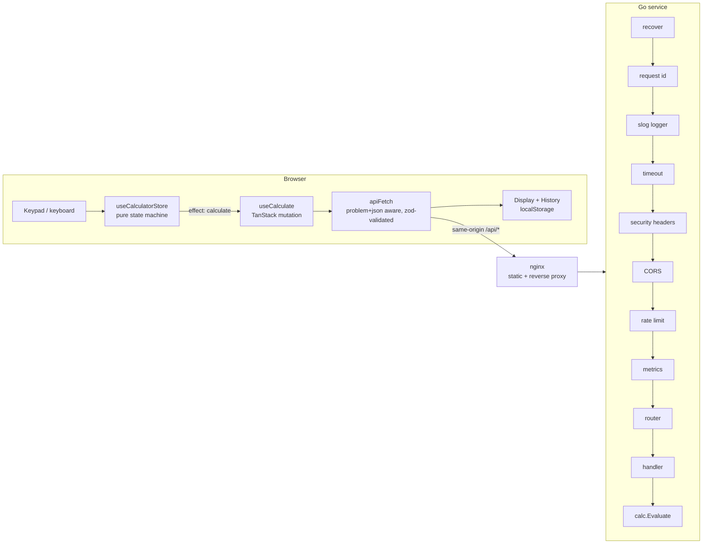
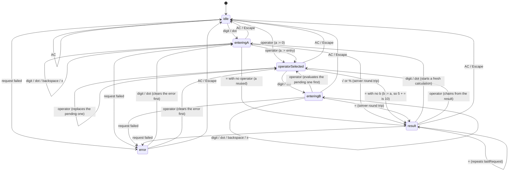

# Architecture

How the two applications are put together, in the order a request travels through them. The *why* of
each choice is in [`PLAN.md`](PLAN.md) §1 and in the [ADRs](adr/README.md); this file is the *what*, so
that someone debugging at 3 a.m. can find the layer that produced a status code without reading the
source first.

## Request flow



Only nginx is published. The browser sees one origin, `/api/` is proxied to the Go service over the
private Compose network, and the API has no host port at all
([ADR-0009](adr/0009-containers-and-proxy.md)). `scripts/smoke.sh` asserts that last part from outside
the containers.

## Backend request lifecycle

`cmd/server.run` builds the chain once with `middleware.Chain(router, …)`. The first entry is the
outermost, so the table reads in the order a request travels down, and unwinds in reverse on the way back
up. Each layer is one file in `internal/middleware` with its own test; the full descriptions are in
[`backend/README.md` § Middleware](../backend/README.md#middleware).

| # | Layer | Answers on its own | Status it can produce |
|---|---|---|---|
| 1 | `Recover` | on a panic below it | `500 INTERNAL` |
| 2 | `RequestID` | never | — (sets `X-Request-ID` on the response and in the context) |
| 3 | `Logger` | never | — (one `slog` line per request, level from the status) |
| 4 | `Timeout` | when `REQUEST_TIMEOUT` expires | `503 TIMEOUT` |
| 5 | `SecurityHeaders` | never | — |
| 6 | `CORS` | on a preflight | `204`, no body |
| 7 | `RateLimit` | when the client's bucket is empty | `429 RATE_LIMITED` + `Retry-After` |
| 8 | `Metrics` | never | — (innermost: only here is the matched route pattern readable) |
| — | `http.ServeMux` | on an unknown path or method | `404 NOT_FOUND`, `405 METHOD_NOT_ALLOWED` + `Allow` |
| — | `httpapi` handler | on a request it cannot accept or evaluate | `400`, `413`, `415`, `422` |
| — | `calc.Registry.Evaluate` | never — it returns a sentinel error | — (mapped to `422` by `httpapi.mapError`) |

Three consequences of that order are worth writing down rather than discovering:

- A **panicking request produces no access log line.** It unwinds past `Logger` before there is a status
  to report, and `Recover` logs it once instead, under the same request ID.
- A **timed-out response carries the request ID but not the headers layers 5 and 6 staged.** The handler
  goroutine is still running and its header map cannot be read safely — `http.TimeoutHandler` drops them
  for the same reason.
- A **preflight and a `429` never reach `Metrics`**, and a request `Timeout` already answered is counted
  with the status its handler eventually returns. The access log carries all three.

The domain package never sees HTTP. `internal/calc` returns errors wrapping one sentinel each
(`ErrDivisionByZero`, `ErrDomain`, `ErrNotFinite`, `ErrUnsupportedOperation`), and exactly one function —
`httpapi.mapError` — turns them into problems with `errors.Is`
([ADR-0003](adr/0003-numeric-model.md), [ADR-0005](adr/0005-problem-json-errors.md)).

## Error taxonomy

Every error is an RFC 9457 `application/problem+json` document with a stable `code`; clients branch on
`code` and never on `title` or `detail`. The catalogue with a full example per code is
[`errors.md`](errors.md) — this table adds *where in the process* each one is produced.

| Code | Status | Produced by | Client behaviour |
|---|---|---|---|
| `INVALID_BODY` | 400 | `httpapi/json.go` — decode | Fix the request; never retry unchanged |
| `VALIDATION_FAILED` | 400 | `httpapi/validate.go` — required / finite fields | Highlight each field in `errors[]`; do not retry unchanged |
| `NOT_FOUND` | 404 | `httpapi/handler.go` — router fallback | Client bug: check base URL and API version |
| `METHOD_NOT_ALLOWED` | 405 | `httpapi/handler.go` — router, sets `Allow` | Use a method from `Allow` |
| `PAYLOAD_TOO_LARGE` | 413 | `httpapi/json.go` — `http.MaxBytesReader` | Client bug: a calculate body is under 100 bytes |
| `UNSUPPORTED_MEDIA_TYPE` | 415 | `httpapi/json.go` — `Content-Type` check | Client bug: send `application/json` |
| `UNSUPPORTED_OPERATION` | 422 | `httpapi/validate.go` — registry lookup | Refresh `GET /api/v1/operations`; do not retry unchanged |
| `UNEXPECTED_OPERAND` | 422 | `httpapi/validate.go` — arity check | Omit `b` for an arity-1 operation |
| `DIVISION_BY_ZERO` | 422 | `calc` sentinel → `httpapi/errors.go` | Show "cannot divide by zero" |
| `DOMAIN_ERROR` | 422 | `calc` sentinel → `httpapi/errors.go` | Show "invalid input" |
| `RESULT_NOT_FINITE` | 422 | `calc` sentinel → `httpapi/errors.go` | Show "result too large" |
| `RATE_LIMITED` | 429 | `middleware/ratelimit.go` (layer 7) | Back off for `Retry-After` seconds, then retry |
| `INTERNAL` | 500 | `middleware/recover.go` (layer 1), or `mapError`'s fallback | Generic error, retry allowed; report `requestId` |
| `TIMEOUT` | 503 | `middleware/timeout.go` (layer 4) | Retry with backoff; a calculation has no side effects |
| `NOT_READY` | 503 | `httpapi/probes.go` — `GET /readyz` while draining | Platform concern: take the instance out of rotation |

The rule that keeps this table stable: **400 means the client sent something the server cannot parse or
accept; 422 means the client sent a perfectly valid request and the arithmetic has no answer.** Everything
else — 404, 405, 413, 415, 429, 5xx — is about the transport or the process, not about the calculation.

Each example body in `errors.md` is byte-identical to the golden file in
`backend/internal/httpapi/testdata/` and to the example in `backend/api/openapi.yaml`;
`TestErrorCatalogueMatchesGoldenFiles` and `TestContractExamplesMatchGoldenFiles` fail the build when they
drift.

## Frontend data flow

```
key press  →  useCalculatorStore.press(input)
                 │
                 ├─ engine:  (state, input) => { state, effect? }      pure; no React, no fetch
                 │
                 └─ effect (a CalculateRequest) ─▶ injected evaluator
                                                     └─ useCalculate (TanStack mutation)
                                                          └─ apiFetch → POST /api/v1/calculate
                                                               ├─ 200          → zod parse → store.applyResult()
                                                               │                              └─ useHistoryStore.add()
                                                               └─ problem+json → ApiError   → store.applyError()
```

Four properties are deliberate:

1. **The engine does no arithmetic.** `src/lib/calculator-engine.ts` never adds, multiplies or divides —
   not even `x / 100` for a bare `%`, and not even the sign flip for `±`, which is done on the entry
   *string*. Every number the user sees came back from the server
   ([ADR-0008](adr/0008-frontend-evaluation-semantics.md)).
2. **The engine does not know about the network.** It returns `{ state, effect? }`; the store performs
   the effect through an injected evaluator and feeds the answer back through `applyResult` / `applyError`.
   That is why the engine is testable as a table and the store is testable with a fake evaluator.
3. **While a request is in flight the phase is already the one the answer will land in**, so
   `applyResult` needs no extra state to know where the number goes. Input is ignored while pending.
4. **Formatting is not state.** `src/lib/format-number.ts` renders `CalcState.display`; a formatted
   string is never fed back into the engine or onto the wire ([ADR-0007](adr/0007-display-precision.md)).

### Calculator state machine



Immediate execution, no precedence: an operator pressed while a second operand is on the display finishes
the pending operation first, so `2 + 3 × 4 =` is 20 and takes two round trips. `=` pressed again repeats
the last evaluation on the running total (`12 + 7 = = =` → 19, 26, 33); only `=` records a repeat, and a
digit typed on a result clears it.

## Storage schema

Nothing writes to `localStorage` directly. `src/lib/storage.ts` is the only module that touches it, and it
exposes `storageKey`, `readJSON`, `writeJSON` and `migrateKeys`.

| Key | Shape | Owner | Cap |
|---|---|---|---|
| `calc.history.v1` | `HistoryEntry[]`, newest first | `useHistoryStore` | `MAX_HISTORY_ENTRIES` = 50 |

```ts
HistoryEntry = {
  id: string,                 // assigned on add
  operation: OperationName,   // "add" | … | "percent"
  a: number,
  b: number | null,           // null for a unary operation (sqrt)
  result: number,
  at: string,                 // ISO 8601
}
```

**Versioning policy.** A key is `calc.<name>.v<version>`. Every read is validated against its zod schema,
and anything missing, unparsable or schema-invalid is treated as *absent* rather than throwing — a
corrupted key costs the user their history, never the page. When a persisted shape changes, bump the
version for that key and call `migrateKeys(prefix, currentKey)` once at hydration: it deletes every key
under the prefix that is not the current one, so a stale `v1` blob can neither leak into `v2` nor linger
unread forever. There is deliberately no in-place upgrade path — history is disposable, and code that
migrates a blob nobody would miss is code that has to be maintained forever.

## Operational notes

**Configuration.** The process is configured entirely by the environment (12-factor); there are no config
files and no flags other than `-version` and `-healthcheck`. Every variable is optional, an unparsable
value is fatal at startup, and *all* bad values are reported at once so one restart shows every mistake.
The full table with defaults is [`backend/README.md` § Configuration](../backend/README.md#configuration).

**Probes.** `GET /healthz` (liveness) answers `200` for as long as the process serves, *including while it
drains* — a draining process must not be restarted. `GET /readyz` (readiness) answers
`200 {"status":"ready"}` while the server accepts work and `503 NOT_READY` from the moment shutdown
starts, before the listener closes. Both send `Cache-Control: no-store` and neither is ever rate limited:
throttling a probe takes a healthy instance out of rotation exactly when it is busiest. The distroless
image has no shell and no `curl`, so the binary probes itself — `server -healthcheck` GETs `/readyz` with
a 2 s deadline and exits 0 or 1, which is what both `HEALTHCHECK` and Compose run.

**Metrics.** A private `prometheus.NewRegistry()`, built in the composition root and injected — never
`prometheus.DefaultRegisterer` ([ADR-0006](adr/0006-runtime-stack.md)). Five families plus the Go runtime
and process collectors, served at `GET /metrics` on the API's own port:

| Family | Type | Labels |
|---|---|---|
| `http_requests_total` | counter | `method`, `route`, `status` |
| `http_request_duration_seconds` | histogram | `method`, `route` |
| `http_in_flight_requests` | gauge | — |
| `calc_operations_total` | counter | `operation`, `outcome` |
| `build_info` | gauge, always 1 | `version`, `commit` |

Cardinality is bounded by this repository, not by what clients send: `route` is the pattern the router
matched (`/api/v1/calculate`, or `unmatched`), never the request target, and `operation` is a name from the
`calc` registry, with anything else counted as `unknown`. What to alert on for each family is tabulated in
[`backend/README.md` § Metrics](../backend/README.md#metrics).

**Shutdown sequence.** `main` owns only the process: it turns SIGINT/SIGTERM into a canceled context and
maps an error to exit 1. Everything else is `run(ctx, args, getenv, stdout)`, which the tests drive exactly
as `main` does. `run` listens *before* it serves, so a bind failure is a returned error rather than a log
line and the startup line reports the real port. On a signal:

1. readiness flips off → `/readyz` starts answering `503 NOT_READY` (`/healthz` keeps answering `200`);
2. wait `PRE_STOP_DELAY` — `0` locally, and about twice the readiness probe period in Kubernetes, so every
   load balancer has dropped the endpoint *before* the listener closes;
3. `http.Server.Shutdown` with `SHUTDOWN_TIMEOUT`: the listener closes and in-flight requests finish;
4. the `stopped` log line reports how long the drain took.

## Threat model

The API is a stateless pure function: it accepts an expression and returns a result, with no accounts,
sessions, or persisted user data — there is nothing to authenticate and nothing to steal, so the design
deliberately ships without auth rather than bolting it on later. The abuse surface that remains is
resource exhaustion, which the backend controls itself: a per-client rate limiter, a request body size
limit, and request-scoped timeouts (see [`SECURITY.md`](../SECURITY.md)). None of this depends on secrets
in the repository or in CI — there are none to leak. A real deployment in front of this service still
needs to add what a demo stack does not provide: TLS termination at the ingress (nginx here serves plain
HTTP inside the Compose network), and a WAF or edge-level rate limiting in front of the per-client limiter
so abusive traffic is absorbed before it reaches the container at all.

## Known limitations

Each of these is a decision or a filed follow-up, not an oversight.

- **`float64` everywhere.** The API returns `0.1 + 0.2 = 0.30000000000000004` unchanged and the UI rounds
  it to `0.3` for display ([ADR-0003](adr/0003-numeric-model.md),
  [ADR-0007](adr/0007-display-precision.md)). That is the right trade for a calculator and the wrong one
  for money; a decimal mode is follow-up [#31](https://github.com/isasumer/go-react-calculator/issues/31).
- **`en-US` locale, fixed.** Grouping character, decimal separator and digit shapes are hard-coded in
  `format-number.ts`. A locale switch is real product work rather than a config flag: follow-up
  [#34](https://github.com/isasumer/go-react-calculator/issues/34).
- **No authentication, no accounts, no server-side state.** History lives in one browser profile, so it
  does not follow the user to another device and two tabs keep two independent histories.
- **One listener.** `/metrics` is served on the API's port next to the probes. A separate admin listener —
  what you want the moment the API port faces the internet — is follow-up
  [#38](https://github.com/isasumer/go-react-calculator/issues/38).
- **Rate limiting is per process and in memory.** Two replicas mean two buckets and a restart forgets
  them; a real deployment needs the limit at the edge as well (see Threat model).
- **`MAX_BODY_BYTES` is parsed and logged but not yet enforced** — the limit is still the 4096-byte
  constant in `internal/httpapi`: follow-up
  [#62](https://github.com/isasumer/go-react-calculator/issues/62).
- **No operator precedence and no expression input.** `2 + 3 × 4 =` is 20, which is what a pocket
  calculator does and not what a parser would do
  ([ADR-0008](adr/0008-frontend-evaluation-semantics.md)).
