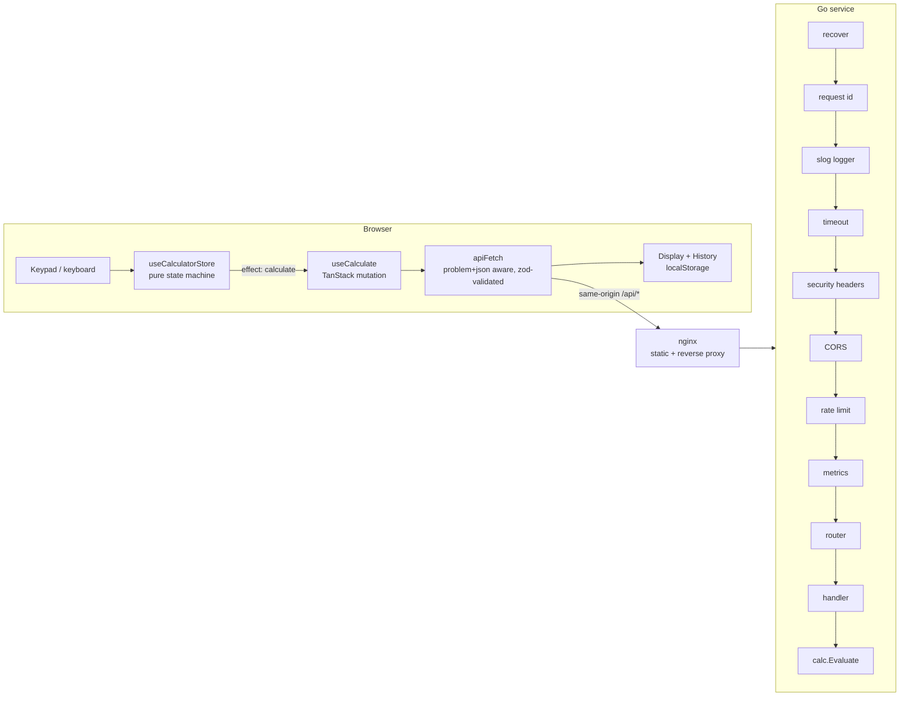

# Architecture

> Stub. Completed by ticket #27 (D4-03) once the implementation exists. The request flow below is the
> contract every ticket builds towards; see [`PLAN.md`](PLAN.md) §1 for the layout and decisions.

## Request flow

## Threat model

The API is a stateless pure function: it accepts an expression and returns a result, with no accounts,
sessions, or persisted user data — there is nothing to authenticate and nothing to steal, so the design
deliberately ships without auth rather than bolting it on later. The abuse surface that remains is
resource exhaustion, which the backend controls itself: a per-client rate limiter, a request body size
limit, and request-scoped timeouts (see [`SECURITY.md`](../SECURITY.md)). None of this depends on secrets
in the repository or in CI — there are none to leak. A real deployment in front of this service still
needs to add what a demo stack does not provide: TLS termination at the ingress (nginx here serves plain
HTTP inside the Compose network), and a WAF or edge-level rate limiting in front of the per-client limiter
so abusive traffic is absorbed before it reaches the container at all.

## Sections to be written (D4-03)
- Backend request lifecycle and where each HTTP status originates
- Error taxonomy (code → status → origin → client behaviour), cross-referenced with [`errors.md`](errors.md)
- Frontend data flow and the calculator state machine (mermaid `stateDiagram`)
- Storage schema and key versioning policy
- Operational notes: configuration, probes, metrics, shutdown sequence
