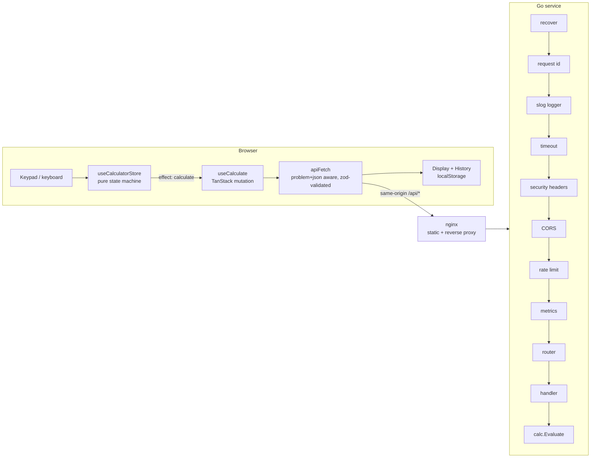

# Architecture

> Stub. Completed by ticket #27 (D4-03) once the implementation exists. The request flow below is the
> contract every ticket builds towards; see [`PLAN.md`](PLAN.md) §1 for the layout and decisions.

## Request flow

## Sections to be written (D4-03)
- Backend request lifecycle and where each HTTP status originates
- Error taxonomy (code → status → origin → client behaviour), cross-referenced with [`errors.md`](errors.md)
- Frontend data flow and the calculator state machine (mermaid `stateDiagram`)
- Storage schema and key versioning policy
- Operational notes: configuration, probes, metrics, shutdown sequence
- Threat model and known limitations
